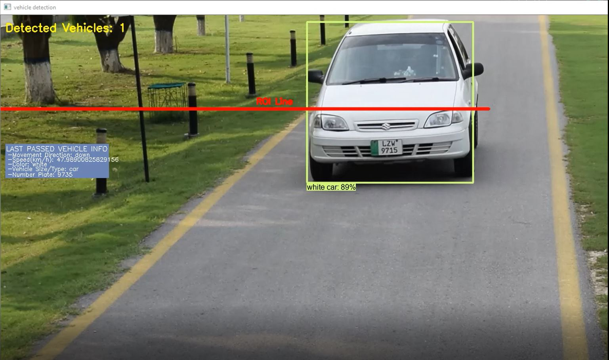

# Vehicle-Speed-NumberPlate-Detection
Vehicle Speed &amp; Number Plate Detection

This is a program that detects the speed, direction, color and type of a moving vehicle along with the recognition of the number/license plate of the vehicle with the help of OCR

# Demo Image

# Demo

Code and updates by me

With great help from: https://github.com/bluesven869/detect-speed-vehicle
